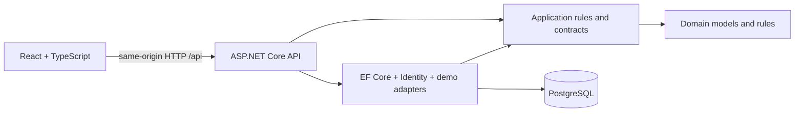

# DishDash

### A good meal. A smarter choice.

**Cook it yourself or order it prepared?** DishDash helps you compare both paths for the same dish, with clear estimates for cost, time and effort.

This is a full-stack portfolio application. Restaurant and grocery providers, payments and delivery updates are **explicit simulations**. No real transactions occur.

## Core experience

1. Discover a dish by cuisine, dietary category, cooking time or grocery budget.
2. Choose 1–12 servings and see ingredient quantities and costs update.
3. Compare cooking with ordering. Each comparison explains the money and time trade-offs.
4. Select a demo grocery basket or restaurant, then complete a safe simulated checkout.
5. Follow the demo order timeline, cook with a saved step-by-step guide, and rate delivered orders.

Accounts include persistent sign-in, dietary preferences, allergen exclusions, favourites, recommendations, notifications and order history.

## Screenshots


More views: [Cook vs Order comparison](docs/screenshots/comparison-desktop.png) · [Mobile discovery](docs/screenshots/discover-mobile.png).

Screenshots show the application running against the isolated relational test host. Photography is illustrative and may differ from the recipe.

## Architecture



The domain has no infrastructure or HTTP dependencies. The application layer owns comparison and recommendation rules and provider contracts. Infrastructure supplies persistence, Identity stores, deterministic provider adapters and the transactional checkout implementation. The API handles HTTP, authentication, authorization, validation and configuration. The React application is organized by feature and uses TanStack Query for server state.

See [architecture](docs/architecture.md), [database model](docs/database.md), and [testing](docs/testing.md).

## Key engineering decisions

- **Same-origin session cookies:** ASP.NET Core Identity hashes passwords. HttpOnly cookies carry sessions; unsafe API requests require an antiforgery token. Session tokens are not stored in browser local storage.
- **Server-authoritative prices:** checkout recomputes all estimates and checks the reviewed total. A database transaction writes the order and notification and clears the basket together.
- **Retry protection:** a user-scoped checkout key is unique. A repeated successful request returns its existing order.
- **Honest provider boundaries:** `IGroceryProvider` and `IRestaurantProvider` have deterministic, explicitly named demo implementations. There are no commercial delivery or grocery integrations.
- **PostgreSQL remains the application database:** SQLite is confined to the test project. Docker is optional and is not a requirement for local development.

## Cook vs Order engine

Ingredient quantities scale by `selected servings / recipe base servings`. Grocery costs are rounded per ingredient to two decimal places, then summed. Estimates price the quantity consumed, **not full packages**. The second grocery adapter applies a fixed 12% premium.

Restaurant estimates multiply a deterministic per-serving price by servings and add one delivery fee per basket line. The comparison picks the lowest total in each path and reports:

```text
Money saved cooking = restaurant total − grocery total
Minutes saved ordering = preparation + cooking minutes − delivery ETA
```

Negative differences reverse the explanation. All displayed prices are CAD; taxes and tips are excluded. Cooking time is recipe-level and does not scale with servings. Provider prices, ratings and ETAs are fictional.

## Recommendation logic

Diet incompatibility and excluded allergens remove a dish before scoring. Remaining dishes receive points for a favourite cuisine, saved dish, affordable grocery estimate and acceptable cooking time. Stable dish IDs break ties. Each suggestion displays its reasons.

Allergen information is limited to the demo recipe labels; it does not certify cross-contact safety. Changing allergen preferences also prevents checkout of an incompatible saved basket.

## Technology

| Area | Stack |
| --- | --- |
| Frontend | React 19, TypeScript 5, Vite 8, Tailwind CSS 4, React Router 7, TanStack Query 5 |
| Backend | .NET 10, ASP.NET Core, Identity, EF Core 10, Npgsql |
| Database | PostgreSQL, versioned EF migrations |
| Tests | xUnit, WebApplicationFactory, Vitest, React Testing Library, Playwright, axe-core |
| Validation | ESLint, production builds, GitHub Actions |

## Local setup

Prerequisites: Node 24, npm, the .NET SDK specified in `global.json`, and PostgreSQL 17 or a compatible supported PostgreSQL installation. Install PostgreSQL using the [official platform packages](https://www.postgresql.org/download/). Docker is not required.

### 1. Create a local database

Connect with an administrative PostgreSQL account, then create a role and database:

```sql
CREATE ROLE dishdash LOGIN;
\password dishdash
CREATE DATABASE dishdash OWNER dishdash;
```

The `\password` command prompts for a password without putting it in SQL history. The application role needs access only to its own database. For a deployed environment, run migrations with a separate migration role and restrict the runtime role to necessary data operations.

### 2. Configure and migrate

From the repository root in PowerShell:

```powershell
dotnet restore backend/DishDash.slnx
dotnet tool restore
$env:ConnectionStrings__DishDash = 'Host=localhost;Port=5432;Database=dishdash;Username=dishdash;Password=YOUR_LOCAL_PASSWORD'
dotnet ef database update --project backend/src/DishDash.Infrastructure --startup-project backend/src/DishDash.Api
$env:Seed__Demo = 'true'
# Optional: sets the password for demo@dishdash.example on first creation.
$env:Seed__DemoPassword = 'CHOOSE_A_LOCAL_12_PLUS_CHARACTER_PASSWORD'
dotnet run --project backend/src/DishDash.Api --launch-profile http
```

Choose a demo password with uppercase, lowercase, a number and a symbol. Omit `Seed__DemoPassword` to seed dishes without a demo account, then register through the UI. `.env.example` documents configuration; **`.env` files are not loaded automatically**. Use process environment variables or a local secret store. Do not put real credentials in repository files.

On bash, use `export ConnectionStrings__DishDash='...'` and the same `dotnet` commands. Set `ASPNETCORE_URLS=http://127.0.0.1:5142` and `ASPNETCORE_ENVIRONMENT=Development` if running without the launch profile.

### 3. Start the frontend

In a second terminal:

```sh
cd frontend
npm ci
npm run dev
```

Open the Vite URL, usually `http://127.0.0.1:5173`. Its `/api` proxy targets port 5142. Keep browser and API access behind the same frontend origin. For a deployment, serve the frontend and proxy `/api` under one HTTPS origin; persist and protect ASP.NET Core Data Protection keys. No production deployment configuration is supplied yet.

### Explore without a local PostgreSQL server

The **test-only** host can demonstrate the UI using a fresh temporary SQLite database:

```sh
dotnet run --project backend/tests/DishDash.BrowserHost --no-launch-profile
# In a second terminal:
cd frontend
npm ci
npm run dev
```

Register an account in the UI. This host is a test harness, is disposable, and is not a substitute for PostgreSQL validation or a deployment mode. Do not run it alongside the main API on port 5142. Its temporary databases contain only test data.

## Demo data

The catalog contains 20 dishes across eight cuisines, recipe ingredients, measured quantities and cooking steps. Demo adapters offer two grocery and two restaurant options per dish. Optional demo-account seeding adds one favourite, three delivered orders, ratings and notifications. Seeding is idempotent for an already-created demo account. No shared account password is embedded in the application.

## API and security

Development OpenAPI: `GET /api/openapi/v1.json`. A visual Swagger UI is not included.

Main routes cover `/api/auth`, `/api/profile`, `/api/dishes`, `/api/favorites`, `/api/recommendations`, `/api/cart`, `/api/orders`, `/api/notifications`, and `/api/ratings`. `GET /api/health` returns only `{"status":"ok"}`; it is liveness, not database readiness. See the [endpoint reference](docs/api.md).

Ownership filters protect saved resources, carts, orders, notifications and ratings. Only delivered orders can be rated. Login has account lockout and per-IP rate limiting. Production cookies require HTTPS. All payment controls are simulation selectors; there are no card fields or payment data models. Error responses do not expose stack traces or infrastructure details.

## Testing

```sh
dotnet test backend/DishDash.slnx
cd frontend
npm run lint
npm test
npm run build
npx playwright install chromium
npm run test:e2e
```

Browser tests use the **production frontend build** and real local HTTP API with relational test persistence. They cover sign-in, search, servings, both checkouts, payment refusal, favourites, recommendations, cooking, order tracking, ratings, notifications, keyboard access, mobile overflow and network failures. Automated WCAG AA checks cover discovery, comparison and registration; they do not establish full accessibility conformance.

CI is configured to run the backend suite against PostgreSQL and browser tests against the isolated SQLite test host. Its status cannot be claimed until the workflow runs. See [validation evidence and limitations](docs/validation.md).

## Known trade-offs

- Local PostgreSQL and Docker execution were unavailable during the recorded validation. PostgreSQL migrations and SQL generation were checked; live PostgreSQL behavior remains to be verified.
- The catalog is loaded in memory for filtering. It is appropriate for 20 seeded dishes; a larger catalog needs database-side search and pagination.
- A basket line has its own delivery fee. Delivery batching, full grocery packages, taxes, tips and price validity windows are not modeled.
- Provider availability and prices are deterministic demo values. Timeline progression is an explicit user action, not background delivery tracking.
- Photography is remotely loaded, illustrative, and not a verified photograph of each recipe. Network access is needed for images.
- Cooking progress is stored per dish on the device, not synchronized to an account.
- There is no email verification, password reset, account deletion, deployment, demo video, or container packaging in this version.

## Future improvements

Verify PostgreSQL and hosted CI, establish a reproducible deployment, replace illustrative photography with recipe-specific licensed assets, add account recovery and deletion, and refine grocery package pricing. Container support can be added independently when Docker can be validated reliably.
