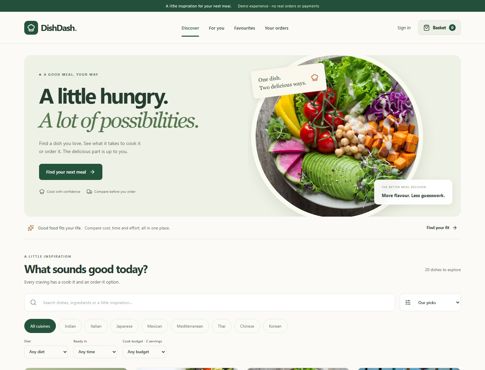
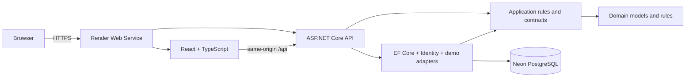

# DishDash

### A good meal. A smarter choice.

**Cook it yourself or order it prepared?** DishDash helps you compare both paths for the same dish, with clear estimates for cost, time and effort.

This is a full-stack portfolio application. Restaurant and grocery providers, payments and delivery updates are **explicit simulations**. No real transactions occur.

## Live application

**Production:** https://dishdash-l9l6.onrender.com

DishDash is deployed as a single Dockerized web service on Render. The React/Vite production build is served by ASP.NET Core under the same HTTPS origin as the API, while application data is persisted in PostgreSQL hosted on Neon.

The production database is managed through versioned Entity Framework Core migrations. Authentication, favourites, cart state, orders, notifications and user preferences persist through the hosted PostgreSQL database.

## Core experience

1. Discover a dish by cuisine, dietary category, cooking time or grocery budget.
2. Choose 1–12 servings and see ingredient quantities and costs update.
3. Compare cooking with ordering. Each comparison explains the money and time trade-offs.
4. Select a demo grocery basket or restaurant, then complete a safe simulated checkout.
5. Follow the demo order timeline, cook with a saved step-by-step guide, and rate delivered orders.

Accounts include persistent sign-in, dietary preferences, allergen exclusions, favourites, recommendations, notifications and order history.

## Screenshots



More views: [Cook vs Order comparison](docs/screenshots/comparison-desktop.png) · [Mobile discovery](docs/screenshots/discover-mobile.png).

The current screenshots were captured during application validation. Photography is illustrative and may differ from the recipe.

## Architecture



The domain has no infrastructure or HTTP dependencies. The application layer owns comparison and recommendation rules and provider contracts. Infrastructure supplies persistence, Identity stores, deterministic provider adapters and the transactional checkout implementation. The API handles HTTP, authentication, authorization, validation and configuration. The React application is organized by feature and uses TanStack Query for server state.

Production uses a same-origin deployment model: the ASP.NET Core service serves the compiled React application and the `/api` endpoints from the same Render service. This keeps session and antiforgery cookies first-party while the API connects to the hosted PostgreSQL database on Neon.

See [architecture](docs/architecture.md), [database model](docs/database.md), and [testing](docs/testing.md).

## Key engineering decisions

- **Same-origin session cookies:** ASP.NET Core Identity hashes passwords. HttpOnly cookies carry sessions; unsafe API requests require an antiforgery token. Session tokens are not stored in browser local storage.
- **Server-authoritative prices:** checkout recomputes all estimates and checks the reviewed total. A database transaction writes the order and notification and clears the basket together.
- **Retry protection:** a user-scoped checkout key is unique. A repeated successful request returns its existing order.
- **Honest provider boundaries:** `IGroceryProvider` and `IRestaurantProvider` have deterministic, explicitly named demo implementations. There are no commercial delivery or grocery integrations.
- **Production PostgreSQL persistence:** PostgreSQL is the application database in production and is hosted on Neon. SQLite remains confined to the isolated test project.
- **Single-origin production deployment:** a multi-stage Docker build compiles the React frontend and ASP.NET Core backend into one deployable Render service.

## Cook vs Order engine

Ingredient quantities scale by `selected servings / recipe base servings`. Grocery costs are rounded per ingredient to two decimal places, then summed. Estimates price the quantity consumed, **not full packages**. The second grocery adapter applies a fixed 12% premium.

Restaurant estimates multiply a deterministic per-serving price by servings and add one delivery fee per basket line. The comparison picks the lowest total in each path and reports:

```text
Money saved cooking = restaurant total − grocery total
Minutes saved ordering = preparation + cooking minutes − delivery ETA
```

Negative differences reverse the explanation. All displayed prices are CAD; taxes and tips are excluded. Cooking time is recipe-level and does not scale with servings. Provider prices, ratings and ETAs are fictional.

## Recommendation logic

Diet incompatibility and excluded allergens remove a dish before scoring. Remaining dishes receive points for a favourite cuisine, saved dish, affordable grocery estimate and acceptable cooking time. Stable dish IDs break ties. Each suggestion displays its reasons.

Allergen information is limited to the demo recipe labels; it does not certify cross-contact safety. Changing allergen preferences also prevents checkout of an incompatible saved basket.

## Technology

| Area       | Stack                                                                             |
| ---------- | --------------------------------------------------------------------------------- |
| Frontend   | React 19, TypeScript 5, Vite 8, Tailwind CSS 4, React Router 7, TanStack Query 5  |
| Backend    | .NET 10, ASP.NET Core, Identity, EF Core 10, Npgsql                               |
| Database   | PostgreSQL, Neon, versioned EF Core migrations                                    |
| Tests      | xUnit, WebApplicationFactory, Vitest, React Testing Library, Playwright, axe-core |
| CI         | GitHub Actions, ESLint, production builds, backend and browser validation         |
| Deployment | Docker, Render                                                                    |

## Local setup

Prerequisites: Node 24, npm, the .NET SDK specified in `global.json`, and PostgreSQL 17 or a compatible supported PostgreSQL installation. Docker is not required for local development.

### 1. Create a local database

Connect with an administrative PostgreSQL account, then create a role and database:

```sql
CREATE ROLE dishdash LOGIN;
\password dishdash
CREATE DATABASE dishdash OWNER dishdash;
```

The `\password` command prompts for a password without putting it in SQL history. The application role needs access only to its own database.

### 2. Configure and migrate

From the repository root in PowerShell:

```powershell
dotnet restore backend/DishDash.slnx
dotnet tool restore

$env:ConnectionStrings__DishDash = 'Host=localhost;Port=5432;Database=dishdash;Username=dishdash;Password=YOUR_LOCAL_PASSWORD'

dotnet ef database update `
  --project backend/src/DishDash.Infrastructure `
  --startup-project backend/src/DishDash.Api

$env:Seed__Demo = 'true'

# Optional: creates the seeded demo account on first initialization.
$env:Seed__DemoPassword = 'CHOOSE_A_LOCAL_12_PLUS_CHARACTER_PASSWORD'

dotnet run --project backend/src/DishDash.Api --launch-profile http
```

Choose a demo password with uppercase, lowercase, a number and a symbol. Omit `Seed__DemoPassword` to seed dishes without a demo account, then register through the UI.

`.env.example` documents configuration, but `.env` files are not loaded automatically. Use process environment variables or a local secret store. Do not commit real credentials.

On bash, use:

```sh
export ConnectionStrings__DishDash='Host=localhost;Port=5432;Database=dishdash;Username=dishdash;Password=YOUR_LOCAL_PASSWORD'
export Seed__Demo='true'
```

If running without the launch profile, use:

```sh
export ASPNETCORE_URLS='http://127.0.0.1:5142'
export ASPNETCORE_ENVIRONMENT='Development'
```

### 3. Start the frontend

In a second terminal:

```sh
cd frontend
npm ci
npm run dev
```

Open the Vite URL, usually `http://127.0.0.1:5173`. Its `/api` proxy targets port `5142` during local development.

Production uses the repository `Dockerfile` to build both the frontend and backend. The Vite production bundle is copied into the ASP.NET Core application's `wwwroot` directory so the React UI and `/api` endpoints are served from the same HTTPS origin.

## Production deployment

The deployed application uses:

```text
Browser
   ↓ HTTPS
Render
   ├── React/Vite static application
   └── ASP.NET Core API
               ↓
          Neon PostgreSQL
```

The Docker image uses separate build stages for Node and .NET:

1. Install frontend dependencies and create the Vite production build.
2. Restore and publish the ASP.NET Core API.
3. Copy the frontend `dist` output into the published API's `wwwroot`.
4. Run the final image using the ASP.NET Core runtime.
5. Bind the service to Render's assigned `PORT`.

Production configuration is supplied through environment variables rather than committed secrets.

Relevant variables include:

```text
ConnectionStrings__DishDash
ASPNETCORE_ENVIRONMENT
ASPNETCORE_FORWARDEDHEADERS_ENABLED
Seed__Demo
Seed__DemoPassword
```

Database credentials and demo passwords must never be committed to the repository.

## Explore without a local PostgreSQL server

The **test-only** host can demonstrate the UI using a fresh temporary SQLite database:

```sh
dotnet run --project backend/tests/DishDash.BrowserHost --no-launch-profile
```

In a second terminal:

```sh
cd frontend
npm ci
npm run dev
```

Register an account in the UI.

This host is a test harness, is disposable, and is not a substitute for PostgreSQL validation or production deployment. Do not run it alongside the main API on port `5142`. Its temporary databases contain only test data.

## Demo data

The catalog contains 20 dishes across eight cuisines, recipe ingredients, measured quantities and cooking steps.

Demo adapters offer two grocery and two restaurant options per dish. Optional demo-account seeding adds one favourite, three delivered orders, ratings and notifications.

Seeding is idempotent for an already-created demo account. No shared account password is embedded in the application.

## API and security

Development OpenAPI:

```text
GET /api/openapi/v1.json
```

A visual Swagger UI is not included.

Main routes cover:

```text
/api/auth
/api/profile
/api/dishes
/api/favorites
/api/recommendations
/api/cart
/api/orders
/api/notifications
/api/ratings
```

The health endpoint:

```text
GET /api/health
```

returns:

```json
{
  "status": "ok"
}
```

The health route is a liveness check rather than a full database-readiness probe.

Ownership filters protect saved resources, carts, orders, notifications and ratings. Only delivered orders can be rated.

Authentication uses ASP.NET Core Identity with HttpOnly session cookies. Unsafe API requests require antiforgery validation. Login includes account lockout and per-IP rate limiting.

Production cookies require HTTPS.

All payment controls are simulation selectors. There are no card fields, banking fields or real payment data models.

Error responses avoid exposing stack traces or infrastructure details.

See the [endpoint reference](docs/api.md).

## Testing

Backend:

```sh
dotnet test backend/DishDash.slnx
```

Frontend:

```sh
cd frontend
npm run lint
npm test
npm run build
```

Browser tests:

```sh
npx playwright install chromium
npm run test:e2e
```

Browser tests use the **production frontend build** and a real local HTTP API with isolated relational test persistence.

Coverage includes:

- registration and sign-in
- dish discovery and search
- serving adjustments
- Cook vs Order comparison
- grocery and restaurant checkout paths
- payment refusal behavior
- favourites
- recommendations
- cooking workflow
- order tracking
- ratings
- notifications
- keyboard accessibility
- mobile overflow
- network failure handling

Automated accessibility checks use axe-core on key workflows. They support accessibility validation but do not establish complete WCAG conformance.

## Continuous integration

GitHub Actions validates the application on pushes and pull requests.

The pipeline checks frontend, backend and browser behavior, including production builds and Playwright journeys.

The production deployment was merged into `main` after the deployment pull request passed the automated validation checks.

See [validation evidence and limitations](docs/validation.md).

## Production validation

The deployed application has been verified through the live Render service using the hosted Neon PostgreSQL database.

Validated production behavior includes:

- application startup and health endpoint
- frontend loading through ASP.NET Core
- direct React Router navigation and page refreshes
- account registration and login
- dish discovery
- favourites
- cart behavior
- checkout/order flows
- PostgreSQL persistence
- HTTPS production access

The deployment uses the same-origin architecture expected by the application's cookie and antiforgery design.

## Known trade-offs

- ASP.NET Core Data Protection keys currently use the Render container filesystem. Replacing the running instance may invalidate existing authentication or antiforgery cookies until persistent key storage is configured.
- The catalog is loaded in memory for filtering. It is appropriate for the current 20-dish catalog; a larger catalog would benefit from database-side search and pagination.
- A basket line has its own delivery fee. Delivery batching, full grocery packages, taxes, tips and price validity windows are not modeled.
- Provider availability and prices are deterministic demo values.
- Timeline progression is an explicit user action rather than background delivery tracking.
- Photography is remotely loaded, illustrative and not guaranteed to represent the exact recipe.
- Cooking progress is stored per dish on the device rather than synchronized to the account.
- There is no email verification, password reset, account deletion or real payment processing in this version.

## Future improvements

Future improvements include:

- persistent ASP.NET Core Data Protection key storage
- database-readiness health checks
- production logging and observability
- email verification and password recovery
- account deletion
- database-side catalog search and pagination
- realistic grocery package pricing
- recipe-specific licensed photography
- real provider integrations behind the existing provider interfaces

## Repository structure

```text
DishDash/
├── backend/
│   ├── src/
│   │   ├── DishDash.Api/
│   │   ├── DishDash.Application/
│   │   ├── DishDash.Domain/
│   │   └── DishDash.Infrastructure/
│   └── tests/
│       ├── DishDash.BrowserHost/
│       ├── DishDash.IntegrationTests/
│       └── DishDash.UnitTests/
├── frontend/
│   ├── e2e/
│   └── src/
├── docs/
├── .github/
│   └── workflows/
├── Dockerfile
├── .dockerignore
├── .env.example
└── README.md
```

## Status

DishDash is a deployed full-stack portfolio application with:

- React and TypeScript frontend
- ASP.NET Core backend
- PostgreSQL persistence
- ASP.NET Core Identity authentication
- automated unit, integration, browser and accessibility testing
- GitHub Actions continuous integration
- Docker production packaging
- Render deployment
- Neon-hosted PostgreSQL

**Live:** https://dishdash-l9l6.onrender.com
