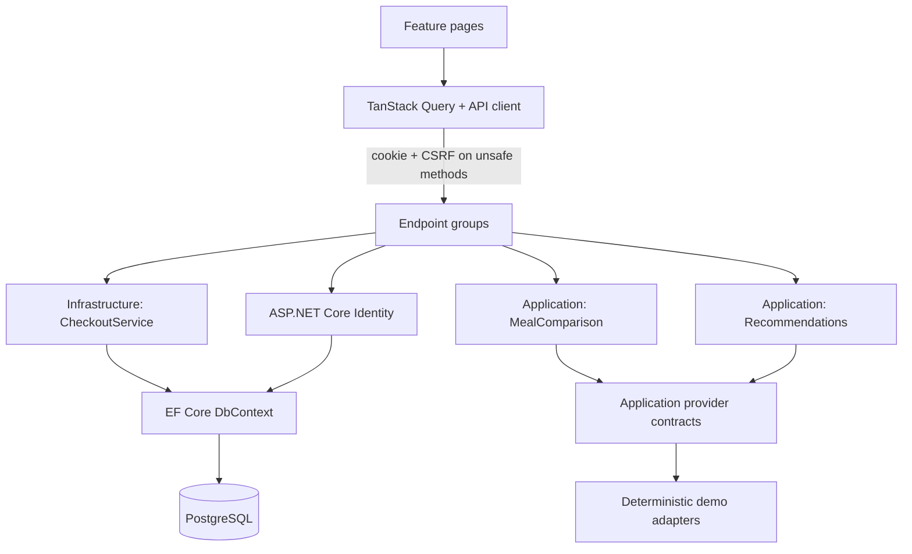
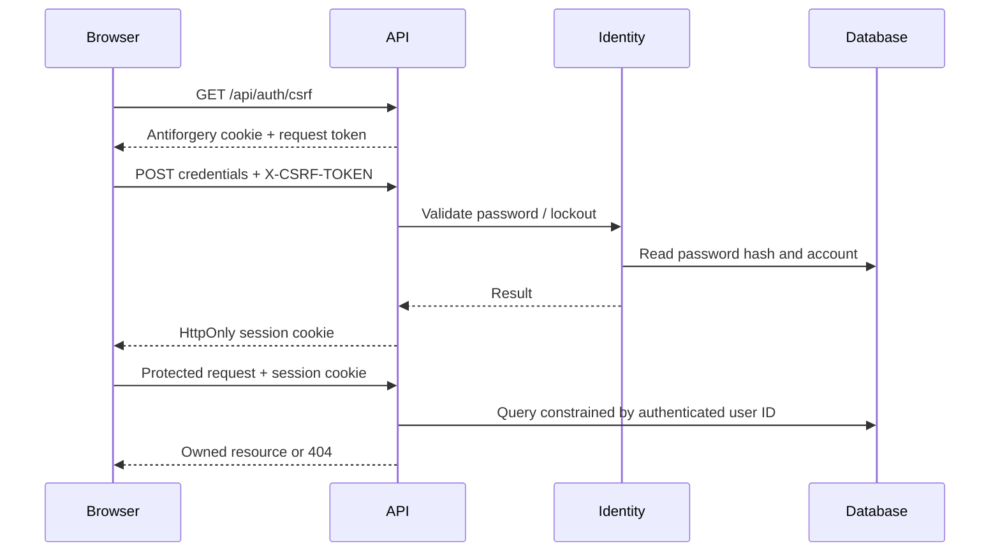
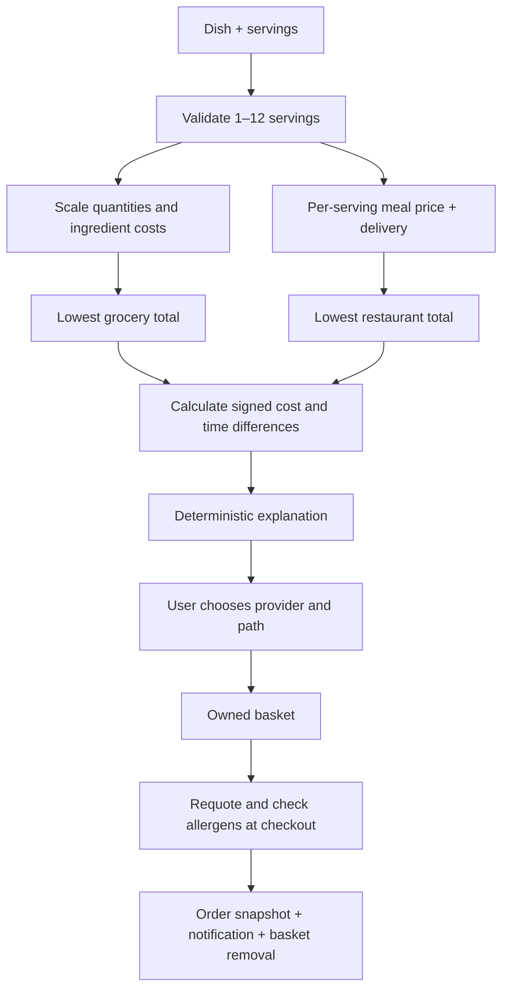

# Architecture

DishDash uses a feature-oriented React application and a pragmatic layered .NET API. Provider values and checkout are deterministic simulations.

## Dependency direction

`Domain` contains entities, scaling, dietary matching, rating rules and order transitions. It has no package dependencies. `Application` depends only on Domain and exposes provider contracts and comparison/recommendation use cases. `Infrastructure` depends on Application and implements Identity persistence, EF Core, seeding, provider adapters and checkout. `Api` references Infrastructure and composes the system.

Checkout lives beside EF Core because its key responsibility is a serializable transaction spanning quotes, order snapshots, notifications and basket removal. A second service/repository abstraction would add indirection without a second implementation. Domain validations and comparison rules remain independently testable.

## Authentication boundary

Cookies use Strict SameSite. Production cookies use Secure. Unsafe API requests require antiforgery validation, including login and registration. The client fetches a current token before each mutation, so authentication changes do not reuse an anonymous identity's request token. Passwords use the Identity password hasher and are never serialized back to the client.

Production must use HTTPS and a persistent protected Data Protection key ring. Configure trusted reverse proxies explicitly if deploying behind one; forwarded headers are not trusted by default. No cross-origin credential policy is enabled.

## Meal decision path

All money calculations use decimal arithmetic on the server. Each ingredient cost is rounded away from zero to cents. Time estimates do not scale with serving count; this simplification is shown in documentation.

## State and failure handling

TanStack Query owns remote state. Successful mutations invalidate queries. Session changes clear the client cache. Protected routes check `/api/profile`; the server independently requires authorization on every protected endpoint.

Requests surface network and API errors. A declined payment leaves the basket intact. A changed price is refused until the user refreshes and reviews it. An allergy-invalidated basket can be cleared. Checkout keys are unique per user; serializable transactions and a unique index prevent duplicate orders. Concurrent database conflicts return a safe retry response where surfaced as EF update failures; deployment-specific serialization behavior still requires PostgreSQL execution.

Guided cooking stores only recipe step, completion and timer deadline in local storage. It reports storage/restore failures. Timers use absolute deadlines so background tabs and reloads do not reset elapsed time. Moving to another step cancels the current step's timer.

Protected profile, order, notification and rating responses use explicit API contracts. Ownership, checkout idempotency keys and concurrency versions remain internal. Order items contain snapshot values and a dish link; notifications and ratings retain order links needed by the UI.

API responses set `X-Content-Type-Options: nosniff`, `Referrer-Policy: no-referrer`, `X-Frame-Options: DENY` and `Cache-Control: no-store`, including error responses. These headers apply to responses served by the API; a separate frontend host must configure its own headers. A frontend Content Security Policy, including `frame-ancestors`, is deferred until the deployment origin, asset hosting and image sources are fixed and can be tested. No speculative CSP is applied to the current remote-image setup.
