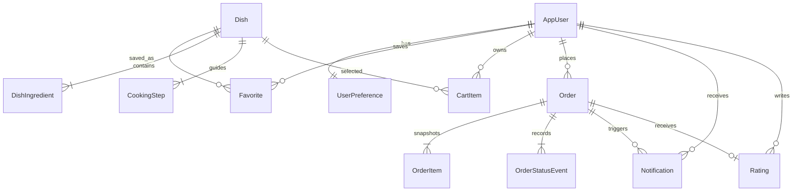

# Database model

Production persistence uses PostgreSQL through EF Core/Npgsql. The checked-in `InitialSchema` migration creates Identity and application tables. Apply migrations explicitly; startup does not silently modify schema.



## Tables and constraints

| Model | Responsibility / constraint |
| --- | --- |
| Identity tables | Accounts, password hashes, lockout, security stamps and supported Identity stores |
| UserPreference | User ID primary/foreign key; diet, excluded allergens, cuisines, servings, budget and time |
| Dish | Seeded recipe, cuisine/diet, allergen labels, illustrative image reference, prep/cook time and effort |
| DishIngredient | Recipe-owned quantity, unit and estimated cost for base servings |
| CookingStep | Recipe-owned sequence, instruction and optional timer |
| Favorite | Composite `(UserId, DishId)` key prevents duplicate favourites |
| CartItem | User-owned selection, dish, servings, fulfillment kind and provider ID; prices are not trusted from the client |
| Order | User-owned total snapshot, request key, timestamp, status and concurrency version |
| OrderItem | Historical name, provider, servings, fulfillment and price snapshot |
| OrderStatusEvent | Append-only events produced by validated transitions |
| Notification | Owned order update, created timestamp and read flag |
| Rating | Unique order ID, author, 1–5 stars and optional comment |

Order has a unique `(UserId, CheckoutKey)` index. `Version` is an optimistic concurrency token for progression. Monetary properties use precision 12, scale 2. Input bounds and business rules are enforced at API/domain boundaries. Referential integrity uses foreign keys; permissions rely on authenticated user IDs, never client-supplied ownership IDs.

Cuisine and dietary classifications are strings, not independent managed catalogs. Ingredients belong to recipes in this version; there is no inventory management use case requiring a shared ingredient master. Grocery stores/products and restaurants/menus are represented by deterministic provider adapters, not fake integration tables. A cart is the user's collection of cart items. These choices keep the model tied to implemented behavior.

## Migrations and seeding

```sh
dotnet tool restore
dotnet ef database update --project backend/src/DishDash.Infrastructure --startup-project backend/src/DishDash.Api
dotnet ef migrations script --idempotent --project backend/src/DishDash.Infrastructure --startup-project backend/src/DishDash.Api
```

Supply `ConnectionStrings__DishDash` via environment. `Seed__Demo=true` enables recipe seeding. A valid `Seed__DemoPassword` additionally creates `demo@dishdash.example` and its sample history only if the account does not exist. Do not enable demo seeding for a real service or run multiple seeders concurrently.

## Relational tests

By default, tests allocate temporary SQLite databases and exercise real EF constraints and transactions. This does not prove PostgreSQL compatibility. Set `DISHDASH_TEST_POSTGRES` to a connection string for a **disposable test server** to run the same API suite against PostgreSQL. The test account requires database-creation rights. Each factory allocates a random `dishdash_test_` database, applies migrations and drops only that allocated database on disposal. Never point this setting at production.

The main application has no SQLite mode. The separate browser test host is a development/testing convenience and must not be deployed.
